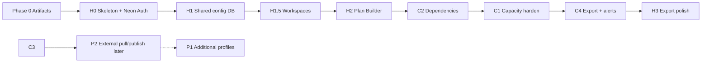

# Flexible Capacity Planner — Build Plan

> **Historical delivery plan.** H0–H3 / C1–C4 / UX1 are shipped. For a current overview of
> the running app (setup, architecture, API), see [`README.md`](./README.md). For open gaps,
> see [`FOLLOW_UPS.md`](./FOLLOW_UPS.md). Keep this file for sequencing context — do not treat
> unchecked boxes below as the live backlog.

**Status:** Delivered through UX1 (working plan retained for history)  
**Sources (reference):**
- [`ideation/CAPACITY_PLANNER_SPECIFICATION.md`](./ideation/CAPACITY_PLANNER_SPECIFICATION.md) — early domain background (archived; some SOX-era language)
- [`ideation/HOSTED_APP_ARCHITECTURE.md`](./ideation/HOSTED_APP_ARCHITECTURE.md) — runtime / SoR / cutover (Neon Auth + path proxy)
- [`ideation/config.excel.example.json`](./ideation/config.excel.example.json) — external embed/edit URL example
- [`templates/blank-styling-template.html`](./templates/blank-styling-template.html) — design tokens + layout chrome
- **Production target:** `https://inaayat.xyz/one-more-column/` — same Neon Auth as `inaayat.xyz/amc-a-lister` (`replacing-nerd-jobs`)

**Non-goals for this document:** calendar-day estimates, staffing Gantt charts. Difficulty is expressed as subsystem invasiveness and dependency risk.

**Non-goals for initial iterations (v1):** scheduled or on-demand **pulls** from external systems — including Jira, HR/calendar APIs, RCM catalogs, SharePoint embeds, or any live sync job. The app is the source of record until a later integration phase.

---

## 0. How to use this plan

| Track | Spec home | Delivery posture |
|---|---|---|
| **Track P — Platform foundation** | Hosted Arch + §4 below | Auth, hosting, Postgres SoR, core domain model |
| **Track C — Capacity & planning** | Spec (reference) + §3 below | Capacity views, dependencies, Plan Builder, export |
| **Track H — Hosted on inaayat.xyz** | Hosted Arch + §4 | Live app at `/one-more-column/` with AMC A-Lister auth |

**Sequencing rule:** Stand up **H0 (skeleton + auth)** early. Layer **capacity hardening → dependencies → Plan Builder** on the hosted stack. **All v1 data enters the app** via direct entry or optional file upload — not external pulls. Domain-specific profiles and interchange formats are **plugins**, not prerequisites for the platform skeleton.



---

## 0A. Input model — initial iterations (v1)

**The platform does not pull data from anywhere in v1.** No Jira sync, no HR feeds, no scheduled imports, no OAuth to external trackers.

| Input path | v1 behavior |
|---|---|
| **Direct entry** | Primary — forms in Plan Builder, resources, policies, manual tasks, capacity grid edits |
| **File upload (optional)** | User-initiated **XLSX or CSV** upload when desired; validate → preview diff → commit to Postgres |
| **External pull** | **Out of scope** until Track P2 (Jira read, HR calendars, etc.) |
| **External publish** | **Out of scope** until Track P2 (writeback to Jira or other trackers) |

**Implications**
- Postgres is the **only** SoR for plan + capacity data in v1.
- `source` on `PlanItem` is `manual` or `file_import` — not `jira_sync`.
- Export (CSV/XLSX download) is fine in v1; import is **push** (user uploads), never **pull**.
- Provider adapters that `fetch_entities()` from live APIs are designed in §3 but **not built** until P2.

---

## 1. Product layers (shared vocabulary)

Freeze these names everywhere:

| Layer | Question it answers | Primary entities |
|---|---|---|
| **L0 — Inputs & assumptions** | What rules and calendars apply this cycle? | `PlanningPolicy`, `Assumption`, calendars, resource profiles |
| **L1 — Plan objects & dependencies** | What work exists, when can it start, what blocks it? | `WorkObject`, `PlanItem`, `Dependency`, scenarios |
| **L2 — Capacity & workload** | Who is overloaded in which week? | `HourAllocation`, capacity views, alerts |

**SoR split**

| Data | SoR in v1 | SoR later (P2+) |
|---|---|---|
| Plan items, capacity allocations, policies, assumptions | **Planning Platform** (Postgres) | Same |
| Resources, PTO, holidays | **Entered or uploaded** in app | Optional HR/calendar pull |
| Master work catalog | **File import or manual** | Optional provider cache |
| Execution status / live tracker fields | **Not modeled** (or static columns from import) | External tracker (e.g. Jira) |
| Ad-hoc work | `PlanItem` (`source=manual` or `file_import`) | Same |

---

## 2. Artifact inventory & gaps to close in Phase 0+

| Artifact | Role today | Gaps / next |
|---|---|---|
| Spec (ideation) | Domain background + long-range vision | Use as reference when defining first planning profile |
| Hosted architecture | Stack, tables, API, H0–H3 | **Decided:** Vercel child project + main-site rewrites + Neon Auth (same as AMC A-Lister); remaining: DB schema ownership, preview trusted domains |
| `ideation/config.excel.example.json` | External embed/edit URLs only | Expand toward full interchange map **or** keep embed-only and add separate import config per profile |
| `templates/blank-styling-template.html` | UI shell + CSS tokens | Use for every new section; preserve split-grid IA |
| Legacy static capacity site (external) | `sync → generate → patch → Pages` | Optional mirror until H cutover |

**Repo hygiene:** styling template path aligned to spec (`templates/…`).

---

## 3. Track C — Capacity & planning (complex delivery)

### C0 — Stabilize knowledge (Phase 0)

**Goal:** Stop knowledge loss; freeze contracts before code sprawl.

| Work item | Detail | Exit |
|---|---|---|
| Spec + README alignment | Docs match intended IA | No contradictory tab/section names |
| Field catalog draft | First profile columns → `FieldDefinition` YAML (`static` \| `dynamic`, type, source, validation) | Reviewed by planning lead |
| Naming freeze | PlanItem, Policy, Dependency, Scenario, PlanningCycle, Resource | Used in code + docs |
| Legacy static site (if any) | Optional read-only reference | Not a v1 dependency; no live sync required |

**Key functionality considerations**
- Catalog **rules**, not broken legacy formulas or dead reference sheets.
- Classify every imported concept as static vs dynamic before building UI.
- Decide open policy questions early enough to avoid dual math (capacity hours; review % variants).

---

### C1 — Capacity hardening

**Goal:** Absorb highest-value L0 concepts into the platform.

| # | Feature | Behavior | Invasiveness |
|---|---|---|---|
| C1.1 | Resource availability overlay | Holidays + per-person weekly (or daily×working days) capacity; show **remaining = capacity − load** | Medium — capacity cells + export bands |
| C1.2 | `PlanningPolicy` knobs | Versioned JSON: weekly capacity, review ratios, overload bands, spread lag, alert proximity | Low–medium — extract magic numbers |
| C1.3 | Align effort math | Configurable review / support-hour rules per policy | Low — must match fixtures / uploaded reference data |
| C1.4 | Assumptions panel | Cycle-tied markdown/JSON visible on Capacity header | Low |
| C1.5 | Manual tasks v1 | Replace iframe embeds with editable tasks **included in capacity math** | Medium — new persistence; UI section |
| C1.6 | Import / edit changelog | Surface “changed since last import or baseline snapshot” (in-app edits + uploads) | Medium — **no external sync changelog in v1** |
| C1.7 | Group / team tabs | Render all capacity groups consistently | Low |
| C1.8 | Three-band coloring (optional) | Unify HTML with export bands | Low — design decision |

**Still external after C1:** phase placement authoring, evidence-matrix authoring, readiness rule ownership (until C2/C3).

**Key functionality considerations**
- **Availability honesty:** Prefer person-specific daily × working days − PTO, not flat weekly defaults.
- **Shared vs local:** Team membership must not remain `localStorage`-only forever (Hosted §2.2).
- **Manual work:** Treat as first-class capacity contributors via `CapacityContributor` interface, not an embed.
- **Spread Work:** Remains UI-only alternate; export policy explicit in `PlanningPolicy`.
- **Overload semantics:** `> capacity` only (exactly at cap is OK) unless policy changes.

**Success metrics**
- Remaining-capacity view matches planner intuition for a known person-week sample.
- Manual-task hours appear in capacity grids.
- Effort policy flags produce identical numbers to fixtures for a reference dataset.

---

### C2 — Dependency & readiness tracker

**Goal:** Model gates that live in spreadsheets / tribal knowledge today.

**Gate types (minimum set — profile-configurable)**

1. Evidence / input readiness → ready-to-start  
2. Sample / selection chains with dated handoffs  
3. Review lag: work due → review due (+ policy offsets)  
4. Phase / milestone threshold rules  
5. Staffing / placeholder-role dependencies  
6. External alignment flags  
7. Calendar blackouts  

**UI:** New **Dependencies & Readiness** section in existing IA (not a separate product). Use blank template chrome (section tabs + view tabs).

**Rule modules to implement as pure functions** — unit-test before UI:

| Module | Role | Inputs → output |
|---|---|---|
| `period_normalizer` | Period labels → canonical keys | Labels → keys |
| `evidence_calendar` | Evidence due dates | Work object × period → due dates |
| `ready_to_start` | Readiness rules | Inputs → ready date |
| `phase_assigner` | Phase / milestone placement | Ready + rules → phase |
| `date_policy` | Review due rules | Work due + cutoff + override → review due |
| `effort_model` | Effort derivation | Work hours → support hours |
| `availability_model` | Capacity grid | Profiles − time off → weekly capacity |
| `capacity_engine` | Allocation | Due-week + spread allocations |

**Key functionality considerations**
- Ready-to-start is a **keystone computed field**, not only a Spread heuristic.
- Profile-specific branches must match reference fixtures exactly.
- Multiple linked predecessors → consistent aggregation rule (e.g. latest start).
- Blackouts are first-class L0 inputs, not footnotes.
- Placeholder roles: decide Resource vs placeholder **before** staffing dependency UX.

**Success metrics**
- Fixture rows produce identical Ready / Phase / Review Due as reference formulas.
- Readiness % view is trustworthy enough to replace informal status glances for one cycle.

---

### C3 — Plan Builder

**Goal:** Authoring spine lives in the app.

**PlanItem spine (editable)**
- Work period, ownership, effort hours, assignees, due dates  
- Computed: ready-to-start, review due, phase, unique key  
- Attributes bag for profile-specific columns via `FieldDefinition` registry

**Data entry (v1)**
- **Direct:** add/edit/delete PlanItems, resources, policies in the UI  
- **Optional upload:** user drops **XLSX or CSV** → map columns → preview diff → commit (`source=file_import`)  
- **Export:** download current plan/capacity as XLSX or CSV safety net  

**Capacity toggle (v1):** **Baseline scenario** vs **edited scenario** — both sourced from Postgres, not a live external execution feed.

**Import pipeline (v1 — build this)**

```
upload (xlsx|csv) → parse → validate against FieldDefinition
  → preview diff vs current cycle → user confirms → upsert plan_items
```

**Provider interface (design now; live adapters in P2)**

```
PlanningSource                    # P2: Jira etc. — not v1
  discover_schema() -> FieldCatalog
  fetch_entities(scope) -> list[RawEntity]   # v1: only file_import + manual paths
  normalize(raw, field_map) -> list[WorkItem]

CapacityContributor
  contributes_hours(work_item) -> list[HourAllocation]
```

**v1 adapters only:** `manual`, `file_import` (XLSX/CSV). **Deferred:** `jira`, HR/PTO pulls, catalog providers.

**Key functionality considerations**
- Do **not** HTML-clone every legacy sheet — migrate process into typed entities.
- Decisions **before** capacity must be first-class PlanItem/Policy fields.
- Scenarios before free-edit-on-live-plan.
- File upload is **optional** — the tool must be fully usable with direct entry only.
- Switch planning authority on a **cycle boundary**, not mid-stream.

**Success metrics**
- Planners run a full cycle slice using **direct entry only** (no upload).
- Optional: sample XLSX/CSV → upload → preview → commit → export round-trip preserves spine fields.
- Scenario vs baseline capacity diffs are explainable item-by-item.

---

### C4 — Export + in-app alerts (v1)

**Goal:** Get data out and surface overload/readiness without external systems.

| # | Feature | v1 |
|---|---|---|
| C4.1 | Export plan + capacity | XLSX and/or CSV download |
| C4.2 | In-app alerts | Overload, date proximity, readiness gaps — computed from Postgres only |
| C4.3 | Drift vs last import | Compare current plan to last committed upload snapshot |

**Deferred to Track P2 — external publish & pull**
- Publish / writeback to Jira (or any tracker)  
- Scheduled or manual **pull** from Jira, HR, RCM, etc.  
- Drift alerts driven by live tracker changes  

See §5 **Track P2** below.

---

## 4. Track H — Hosted on inaayat.xyz (Neon Auth + path proxy)

**Production URL:** `https://inaayat.xyz/one-more-column/`  
**Auth:** Same Neon Auth users as `https://inaayat.xyz/amc-a-lister/` (`replacing-nerd-jobs`)  
**Pattern:** Separate Vercel project for this repo; main inaayat.xyz project **rewrites** `/one-more-column/*` and `/api/omc-*` to the child deployment.

### 4A. Does AMC-style auth complicate creation?

**No — it simplifies hosted delivery vs a separate corporate IdP.**

| Concern | Impact |
|---|---|
| Auth identity | **Reuse** — same `NEON_AUTH_BASE_URL`, same JWT `sub` as AMC A-Lister; login via existing `/account.html?next=/one-more-column/` |
| Client auth code | **Copy/adapt** — `engine/neon-browser-auth.js` + AMC’s `engine/auth.js` pattern |
| Server auth | **Copy** — `lib/neon-auth.js` + `getAuth(req)` / `auth.sub` as in `api/me.js` |
| Secrets | **Same env vars** — child Vercel needs `NEON_AUTH_BASE_URL` + `DATABASE_URL` (preview + proxied API); main site already has them for `/api/auth-config` |
| Cross-repo wiring | **Small one-time PR** on `replacing-nerd-jobs`: 3 rewrites + optional index link |
| Path prefix | **Required discipline** — every page needs `<base href="/one-more-column/" />`; API routes use `omc-` prefix (like `alist-` / `pc-`) |
| Neon Console | **No change** for production path (still `inaayat.xyz` origin); add child preview URL only if testing direct deploys |

**What it does *not* require:** inventing corporate SSO, a custom password store, or duplicating Neon Auth config on the child for production browser auth-config (browser hits main `/api/auth-config`).

**Recommended deploy mode:** main-site rewrites (independent deploys).  
**Simpler-ops alternative:** git submodule at `one-more-column/` inside `replacing-nerd-jobs` (one Vercel project, shared `api/` + env). Prefer rewrites unless ops overhead dominates.

```
User → inaayat.xyz/one-more-column/
         ↓ (Vercel rewrite on replacing-nerd-jobs)
         one-more-column.vercel.app/one-more-column/
```

### 4B. Repo layout (mirror AMC A-Lister path pattern)

```
one-more-column/                 ← this git repo, also URL path prefix
  index.html                     ← <base href="/one-more-column/" />
  engine/
    auth.js                      ← adapt from amc-a-lister/engine/auth.js
    api.js
    neon-browser-auth.js
    …capacity / plan modules…
  icon.svg
  templates/blank-styling-template.html
api/
  one-more-column.js             ← router; exposed as /api/omc-:route
lib/
  neon-auth.js                   ← copy from replacing-nerd-jobs/lib/neon-auth.js
  db.js                          ← Neon serverless Postgres
package.json                     ← jose, @neondatabase/serverless
vercel.json
```

**Child `vercel.json` (illustrative):**

```json
{
  "framework": null,
  "outputDirectory": ".",
  "rewrites": [
    { "source": "/api/omc-:route", "destination": "/api/one-more-column?route=:route" }
  ]
}
```

**Main site (`replacing-nerd-jobs`) rewrites to add:**

```json
{
  "source": "/one-more-column",
  "destination": "https://one-more-column.vercel.app/one-more-column"
},
{
  "source": "/one-more-column/:path*",
  "destination": "https://one-more-column.vercel.app/one-more-column/:path*"
},
{
  "source": "/api/omc-:route",
  "destination": "https://one-more-column.vercel.app/api/omc-:route"
}
```

Optional: `<a href="/one-more-column/">One More Column</a>` on inaayat.xyz index.

### 4C. Auth checklist (must stay green)

| Check | Path setup (`/one-more-column`) |
|---|---|
| Same Neon users as AMC A-Lister | Yes — same `NEON_AUTH_BASE_URL` |
| Use main `/account.html` | Yes — `?next=/one-more-column/` |
| `fetch('/api/auth-config')` | Hits **main** API on inaayat.xyz |
| JWT `sub` = AMC A-Lister `user_id` | Yes |
| Logout redirect | `/one-more-column/` |
| API `getAuth(req)` → 401 if missing | Same as `api/me.js` |
| Child env for preview / proxied API | `NEON_AUTH_BASE_URL`, `DATABASE_URL` |

### 4D. Cutover phases

**Completed:** H0, H1, H1.5, H2 (Plan Builder + scenarios + CSV import), C2 (dependencies + readiness core).

| Phase | Status | Goal | Parity bar |
|---|---|---|---|
| **H0 — Skeleton + auth** | Done | Static shell under `/one-more-column/` with blank template tokens; Neon Auth login/logout; stub `/api/omc-me`; main-site rewrites live | Signed-in user sees same identity as on `/amc-a-lister/` |
| **H1 — Shared config in DB** | Done | Resources, teams, policies, manual `plan_items` in Neon Postgres; capacity read API | localStorage no longer SoR for teams |
| **H1.5 — Workspaces** | Done | Top-level isolation: workspace-scoped resources + cycles; workspace switcher; `cycle_type` (annual/quarter/sprint); FY→FY is new cycle in same workspace | Multiple team plans with separate resource pools; one account accesses all workspaces |
| **H2 — Plan Builder on Postgres** | Done | Direct entry + CSV import → `plan_items`; scenario create/clone; scenario toggle on capacity | One cycle planned in-app without external pull |
| **C2 — Dependencies & readiness** | Done (core) | `dependencies` table, gate types, readiness summary, `ready_to_start` / `date_policy` engines | Readiness % view from Postgres gates |
| **C1 — Capacity harden** | Done | Availability/PTO overlay, three-band coloring, team tabs, effort model, changelog (assumptions UI later removed in favor of Planner gates) | Remaining-capacity view with honest PTO deduction |
| **H3 / C4 — Export + polish** | Done | CSV export (plan + capacity), alerts engine (UI archived), import drift compare | Export + overload signals from Postgres-only data |
| **UX1 — Guided setup** | Done | Wizard, sidebar shell, task-types-before-work, reachable guide | New users can create a plan without hunting |
| **P2 — External integrations** | Later | Jira pull/publish, HR calendars | Explicit publish + audit |

**Stack defaults:**

| Layer | Choice | Why |
|---|---|---|
| Hosting | Vercel (child project) + rewrites from `replacing-nerd-jobs` | Matches inaayat.xyz apps |
| Auth | Neon Auth + `jose` JWKS verify | Same as AMC A-Lister |
| DB | Neon Postgres (`DATABASE_URL`) | Shared platform; same user `sub` |
| Frontend | Static HTML + ES modules (AMC pattern) **or** light SPA later | Lowest friction with `<base href>` |
| API | Vercel serverless `api/one-more-column.js` with `omc-` routes | Parallel to `alist-` / `pc-` |
| Calc engines | Pure JS or Python workers as needed | Unit-tested pure functions |

Corporate Okta / ECS from early Hosted Arch drafts is **out of scope** for inaayat.xyz unless a separate enterprise deploy is later required.

**Module map**

| Module | Responsibility |
|---|---|
| `engine/auth.js` | Session, login link, logout (AMC pattern) |
| `lib/neon-auth.js` | JWT verify for API routes |
| `providers.manual` / `providers.file_import` | Normalize manual + uploaded rows |
| `engines.*` | Pure calc (readiness, dates, effort, availability, capacity, alerts) |
| `api/omc-*` | Plan CRUD, capacity, import, export (v1) |
| `services.import` / `export` | XLSX/CSV parse + download |

**API surface — v1 (`omc-` prefixed):**  
`omc-me`, `omc-workspaces`, `omc-scenarios`, `omc-cycles`, `omc-policy`, `omc-plan-items`, `omc-dependencies`, `omc-capacity`, `omc-resources`, `omc-import`, `omc-alerts`, `omc-export`

**Workspace scoping:** `omc-cycles` and `omc-resources` require `?workspace=<id>`. Resources belong to a workspace and persist across cycles within it (editable cycle-over-cycle, not required). Capacity derives workspace from the selected cycle.

**Deferred to P2:** `omc-sync`, `omc-publish` (and any live provider routes)

**Key functionality considerations**
- Auth before real Plan Builder data (H0 before H2).  
- Postgres SoR; **no external sync mirrors in v1**.  
- JSONB `attributes` + `field_definitions` — no migration per new column.  
- App roles (Viewer / Planner / Publisher / Admin) layered **on top of** Neon identity (allowlist keyed on `auth.sub`).  
- Keep Mulish tokens / split-grid UX from blank template.  
- Never call child-origin `/api/auth-config` from production pages — always same-origin main site.  
- Prefix discipline: do not collide with `/api/alist-*` or `/api/pc-*`.

---

## 5. Track P — Profiles & extensibility

After the core loop works (`enter or upload → plan → capacity → export`), add planning **profiles** without forking the platform.

## 5A. Track P2 — External integrations (explicitly not v1)

**Do not build until v1 direct-entry + optional upload is trusted.**

| Capability | v1 | P2 |
|---|---|---|
| Jira (or tracker) **pull** | — | Read issues/estimates on demand or schedule |
| Jira (or tracker) **publish** | — | Diff approve → writeback |
| HR / calendar pull | — | PTO, holidays |
| Live drift vs tracker | — | Alerts when tracker changes post-publish |
| Provider `fetch_entities()` | Interface only | Implement adapters |

**Key functionality considerations**
- Explicit publish only; never silent writeback.  
- Tracker token rotation / least-privilege bot user when P2 ships.  
- Audit every publish and policy change.

### Capability expansion map

| Capability | First profile | Generalization |
|---|---|---|
| Capacity | Work + review hours | Configurable FTE/hours models per profile |
| Dependencies | Evidence → ready → work → review | Arbitrary predecessor / gate graphs |
| Workload | Balance assignees | Intake queues, WIP limits, prioritization |
| Roadmapping | Phased cycles | Quarters, releases, milestones |
| Resources | Placeholder roles, PTO | Skills, hiring plans, shared pools |

### Domain model (profile-aware)

`PlanningCycle` (profile = `default` \| `ops` \| `project` \| …) · `PlanningPolicy` · `Resource` / profiles / time_off · `Assumption` · `WorkObject` · `PlanItem` · `Dependency` · `ForecastFactor` · `HourAllocation` · `Scenario` / baselines · `FieldDefinition` · `Provider`

### UX sections (profile-aware)

1. Cycle / Profile Setup  
2. Plan Builder  
3. Dependencies & Readiness  
4. Capacity / Workload  
5. Execution Sync (navigator, alerts, export) — **v1: no live sync**  
6. Insights (readiness %, burn, remaining)

**Key functionality considerations**
- Extensibility rule: unknown fields → `attributes{}` + registry; new forecast factors register as rules.  
- Adapter loop (v1): `manual | file_import → normalize → PlanItem store → Rule engine → Capacity engine → Views`  
- P2 adds: `Provider.fetch → …` and optional publishers  
- Non-ticket work = `PlanItem` with `source=manual` — retires permanent iframe embed pattern.  
- One design system across profiles.

---

## 6. Cross-cutting key functionality checklist

Use this as a design review gate for every feature PR:

### Capacity math
- [ ] Gross vs net capacity (profiles − PTO/holidays/blackouts)  
- [ ] Assignee vs reviewer contribution rules preserved  
- [ ] Due-week vs Spread modes explicitly labeled; export policy clear  
- [ ] Overload threshold from `PlanningPolicy`, not hard-coded defaults  
- [ ] Hour allocations attributable to a PlanItem / work key (drill-down)

### Planning brain (L0/L1)
- [ ] Ready-to-start computed, not only inferred for Spread  
- [ ] Phase assignment + period normalization versioned per cycle  
- [ ] Profile attributes (reliance, sampling, evidence, etc.) in plan attributes  
- [ ] Assumptions visible and owned  
- [ ] Dependencies typed with status (static vs dynamic)

### Flexibility without chaos
- [ ] New columns → FieldDefinition, not hard-coded schema  
- [ ] Import/upload path behind same normalize interface as future providers  
- [ ] Scenarios + baselines before multi-user free edit  
- [ ] **v1:** no background pull jobs; **P2:** explicit publish + audit  

### Spreadsheet / interchange
- [ ] **v1:** optional user-initiated XLSX/CSV upload — validate → preview diff → commit  
- [ ] **v1:** direct entry covers all fields without requiring upload  
- [ ] Export uses templates; stable logical field names via maps  
- [ ] Embed config either replaced by PlanItems or kept as transitional only  

### UX / design system
- [ ] Mulish + tokens from blank template  
- [ ] Split person pane + week grid preserved for capacity  
- [ ] Badges over cards; no purple-gradient / cream-serif drift  
- [ ] New sections fit existing top-nav IA  
- [ ] Shared preferences eventually DB-backed  

### Security
- [ ] Secrets not in git; **P2:** tracker creds in Vercel env when integrations ship  
- [ ] Neon Auth JWT verified via `lib/neon-auth.js` on every mutating `omc-*` route  
- [ ] AuthZ roles on mutate/export (allowlist keyed on `auth.sub`)  
- [ ] Audit import commits + policy changes  
- [ ] Authenticated exports  
- [ ] `<base href="/one-more-column/" />` on every page; login via `/account.html?next=/one-more-column/`  
- [ ] `omc-` API prefix; no clash with `alist-` / `pc-`  

---

## 7. Suggested repo / package shape (target)

```
one-more-column/                       ← git repo + URL path
├── ideation/                          ← archived Phase 0 specs
│   ├── CAPACITY_PLANNER_SPECIFICATION.md
│   ├── HOSTED_APP_ARCHITECTURE.md
│   └── config.excel.example.json
├── BUILD_PLAN.md                      ← this file (historical)
├── FOLLOW_UPS.md                      ← current known gaps
├── README.md                          ← current overview
├── package.json                       ← jose, @neondatabase/serverless
├── vercel.json                        ← omc- → api/one-more-column rewrites
├── index.html                         ← <base href="/one-more-column/" />
├── icon.svg
├── templates/                         ← design-token / chrome reference HTML
│   └── blank-styling-template.html
├── engine/
│   ├── auth.js                        ← AMC A-Lister pattern
│   ├── neon-browser-auth.js
│   ├── api.js                         ← fetch /api/omc-*
│   └── …capacity / plan UI…
├── lib/
│   ├── neon-auth.js                   ← JWT verify (copy from replacing-nerd-jobs)
│   └── db.js
├── api/
│   └── one-more-column.js             ← route= me|capacity|plan-items|…
├── schemas/
│   ├── field_definitions.default.yaml ← archived sketch (superseded by task_type_fields)
│   └── planning_policy.schema.json
├── engines/                           ← pure calc, unit-tested
│   ├── ready_to_start.*
│   ├── date_policy.*
│   ├── effort.*
│   ├── availability.*
│   ├── capacity.*
│   ├── period_*.*
│   └── alerts.*
└── lib/handlers/                      ← omc-* resource handlers
```

**Sibling wiring (not in this repo):** `replacing-nerd-jobs/vercel.json` path + `/api/omc-*` rewrites to this project’s Vercel URL.

This repo is the **spec + hosted SoR + UI** home.

---

## 8. Cycle-based transition playbook

| Stage | Authority | App role |
|---|---|---|
| **v1 start** | Spreadsheet or blank | Direct entry + optional upload; app is SoR |
| **v1 steady** | App (Postgres) | Plan, capacity, export; no external pull |
| **P2 optional** | App plans; tracker executes | Pull + publish to Jira (or other) when needed |
| **P2 steady** | App for plan; tracker for execution status | Diff publish + drift alerts |

Cut authority only on cycle boundaries.

---

## 9. Decision log (defaults until overturned)

| # | Decision | Source |
|---|---|---|
| 1 | Platform-first delivery; profiles are plugins | This plan |
| 2 | Postgres (Neon) SoR for hosted; not SQLite prod | Hosted #1 |
| 3 | Neon Auth before real Plan Builder data | Hosted #2 |
| 4 | Scenarios before free-edit-on-live | Hosted #3 |
| 5 | **v1: no external pull**; optional XLSX/CSV upload + direct entry | Owner decision |
| 6 | Explicit publish only (**P2**) | Hosted #4 |
| 7 | Static mirror optional; not required for v1 | Hosted #5 |
| 8 | Same CSS tokens / Mulish for planning UI | Hosted #6 |
| 9 | External tracker as execution SoR (**P2+**) | Domain model |
| 10 | FieldDefinition + attributes early | Extensibility |
| 11 | Do not migrate DNU / broken formulas | Import hygiene |
| 12 | Production at `inaayat.xyz/one-more-column/` via main-site rewrites | Owner decision |
| 13 | Same Neon Auth / `auth.sub` as AMC A-Lister | Owner decision |
| 14 | Prefer separate Vercel project + rewrites over submodule | Owner recommendation |
| 15 | API route prefix `omc-` | Align with `alist-` / `pc-` |
| 16 | `omc-import` / `omc-export` in v1; `omc-sync` / `omc-publish` in P2 | This plan |

---

## 10. Open questions (blockers to resolve)

**Policy / math**
1. Support-hour rules: flat % vs floor vs phase-specific variants?  
2. Who seeds yearly evidence / calendar tables — manual entry, upload template, or wait for P2?  
3. Placeholder roles = Resources or placeholders?  
4. Leadership reporting: flat weekly cap vs person-specific daily model?

**Hosting / auth (mostly decided — remaining)**
5. ~~Hosting target?~~ → **Vercel child + `replacing-nerd-jobs` rewrites**  
6. ~~IdP?~~ → **Neon Auth (same as AMC A-Lister)**; still need app-role allowlist design (Viewer/Planner/Publisher/Admin keyed on `sub`)  
7. Keep static mirror after hosted app exists?  
8. Retention for import snapshots + audit logs?  
9. Shared Neon DB with inaayat.xyz apps vs dedicated database/branch for OMC tables?  
10. Add `one-more-column.vercel.app` as Neon Auth trusted origin for preview deploys?  

**Interchange**
11. Default upload formats: CSV only first, or XLSX + CSV in v1?  
12. Expand `ideation/config.excel.example.json` into a full field map, or add separate upload template per profile?

**P2 (defer until v1 ships)**
13. First tracker pull/publish timing and which system?  
14. Scheduled sync vs on-demand pull only?

---

## 11. Immediate next actions (post–Phase 0)

> **Superseded.** These bootstrap steps are done. See [`README.md`](./README.md) and
> [`FOLLOW_UPS.md`](./FOLLOW_UPS.md) for what remains.

1. ~~Resolve open questions §10.1 and §10.4~~  
2. ~~Author first profile field registry~~ → replaced by per–task-type fields in the UI  
3. ~~Extract pure `engines/*`~~  
4. ~~H0 bootstrap~~  
5. ~~C1 + direct entry on hosted stack~~  
6. ~~`omc-import` / `omc-export`~~  
7. **Do not** start Jira pull/publish or `omc-sync` until a later P2 phase.

---

*README = current overview; FOLLOW_UPS = living backlog; this Build Plan = sequencing history; ideation = Phase 0 archive.*
