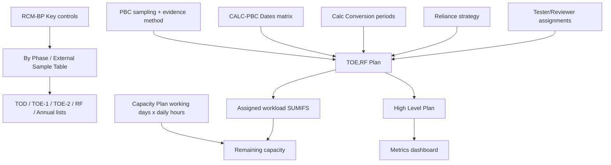

# Capacity Planner — Specification

> **Archived Phase 0 document.** The shipped product is a general flexible capacity planner
> (task types, Planner, Capacity, Team) hosted at `/one-more-column/`. Part A below retains
> SOX-era language from the original problem domain and should **not** drive new UI copy or
> schema. Authoritative current docs: [`../README.md`](../README.md), [`../FOLLOW_UPS.md`](../FOLLOW_UPS.md).

**Status:** Archived (historical)  
**Audience:** Anyone reconstructing early product decisions  
**Sources analyzed (at time of writing):**
- Current application: capacity planner repo (sync → generate → patch → GitHub Pages)
- Live export: tool-generated capacity Excel export
- Non-Jira embed: Non-Jira tracking workbook
- Primary planning workbook: All Up Plan Excel workbook (30 sheets)

---

## How to read this document

This specification was intentionally split into **two parts**:

| Part | What it is | Use it for |
|---|---|---|
| **[Part A — SOX Capacity Planner](#part-a--sox-capacity-planner)** | Spec for the original tool, Excel planning process, and next steps as a dependency tracker / planning surface | Historical context only |
| **[Part B — Flexible Planning Platform](#part-b--flexible-planning-platform-aspirational)** | Vision: generalize to many task types with flexible inputs on a hosted site with DB + auth | Mostly realized; see README for what actually shipped |

**Related docs:**
- [`../README.md`](../README.md) — current app overview
- [`../BUILD_PLAN.md`](../BUILD_PLAN.md) — phased delivery history
- [`HOSTED_APP_ARCHITECTURE.md`](./HOSTED_APP_ARCHITECTURE.md) — hosting deep dive
- [`../templates/blank-styling-template.html`](../templates/blank-styling-template.html) — UI shell / design tokens

---

# PART A — SOX Capacity Planner

> **Scope:** Business Process (BP) SOX testing capacity and the planning process that feeds it.  
> **Runtime today:** Static dashboard on GitHub Pages, fed by hourly Jira sync.  
> **Next steps in this part:** Harden capacity → add dependency / readiness tracking → absorb Excel All Up planning into a SOX Plan Builder — still SOX-focused.

---

## A1. Purpose and layers

Today’s Capacity Planner is a **read-only, Jira-fed capacity visualizer**. It answers: *given estimates and due dates already in Jira, who is overloaded in which week?*

The Excel “All Up Plan” answers an earlier question: *what should we test, when can we start, what depends on PBC readiness, who should own it, and what assumptions drive those decisions?* Capacity math is only the last mile.

**SOX evolution (Part A only):**

| Layer | Purpose | Today | Part A next steps |
|---|---|---|---|
| **L0 — Inputs & assumptions** | Reliance, frequency, sample tables, staffing calendars, blackout rules | Almost entirely Excel | Assumptions panel + policy config in-app |
| **L1 — Plan objects & dependencies** | Phases, ready-to-test, PBC chains, staffing | Partially Jira; heavily Excel | Dependency tracker → SOX Plan Builder |
| **L2 — Capacity & workload** | Weekly load vs availability | Live GitHub Pages dashboard | Availability overlays; remain on Pages until/unless Part B hosting |

Do **not** recreate the 30-sheet workbook as HTML. Migrate the *SOX planning process* into typed entities and workflows that feed L2.

---

## A2. Current-state architecture

### A2.1 What the product is

A Python-generated static dashboard (not a persistent web app):

```
Jira (configured parent initiative)
    │  sync.py  (hourly Mon–Fri)
    ▼
capacity.db (SQLite, local/CI only)
    │  generate.py
    ▼
capacity.html + MM.DD.YY_Capacity.xlsx
    │  patch_html.py
    ▼
dist/ → GitHub Pages
```

**Live URL:** private GitHub Pages deploy (URL omitted)

### A2.2 Core files

| File | Role |
|---|---|
| `sync.py` | Jira pull → SQLite |
| `jira_api.py` | HTTPS/auth/path guardrails |
| `generate.py` | Capacity math, HTML UI, Excel export (~7k lines) |
| `patch_html.py` | Deploy path/URL rewrites → `dist/` |
| `field_map.json` | Logical planning field → custom field ID |
| `jira_field_catalog.json` | Full field ID → display name catalog |
| `config.deactive_users.json` | Shared Deactive roster |
| `config.excel.json` | SharePoint Non-Jira embed/edit URLs |
| `data/issue_comments.json` | Daily comment snapshot (Navigator) |
| `data/issue_changelog.json` | Manual changelog archive (not UI-consumed) |

### A2.3 Workflows

| Workflow | Cadence | Action |
|---|---|---|
| `capacity-plan.yml` | Hourly Mon–Fri | sync → generate → patch → Pages deploy |
| `comments-sync.yml` | Daily ~02:36 UTC | Incremental comments → commit JSON |
| `changelog-sync.yml` | Manual only | Full changelog dump |

---

## A3. How the Capacity Planner works today

### A3.1 Scope of work items

1. Fetch children of the **configured parent initiative** (epics).
2. Fetch children of those epics in batches of 50.
3. Persist every field (`fields=*all`) as JSON per issue.
4. For planning rows, exclude:
   - Issue type `Epic`
   - Status `Canceled`

### A3.2 Fields that drive capacity

| Logical use | Jira source | Notes |
|---|---|---|
| Tester | QA Agent (fuzzy-mapped) | Required for tester capacity |
| Tester due | Tester Due Date | ISO week bucket for test hours |
| Reviewer | Approver | Required for reviewer capacity |
| Review due | Review Due Date | ISO week bucket for review hours |
| Estimate | `timeoriginalestimate` (seconds) | Converted to hours |
| Team / CG | Control Group | BP / IT / etc.; some people forced to a control group |
| Work item | Work Item Key | Display / join helper |
| Reliance | SOX Testing Reliance Strategy | Display + external date resolution |
| Linked PBCs | Issue links → PBC Evidence Request | Spread Work + alerts |

### A3.3 Capacity allocation (default)

**Assumption:** `WEEKLY_CAPACITY_HOURS = 32`

```
test_hours    = round(timeoriginalestimate / 3600, 4)
review_hours  = round(test_hours × 0.35, 4)

tester_week[person][iso_week(tester_due)]   += test_hours
reviewer_week[person][iso_week(review_due)] += review_hours
weekly_total = tester + reviewer
```

A person-week is **overloaded** only when `total > 32` (exactly 32 is OK).

**Contribution rules:**
- Tester load requires: QA Agent + Tester Due Date + Original Estimate
- Reviewer load requires: Approver + Review Due Date + computed review hours

### A3.4 Spread Work mode (UI-only alternate)

Browser toggle (`localStorage['capacity_spread']`) switches to a precomputed allocation:

1. Resolve a **PBC-derived start** for each workpaper:
   - Single PBC → PBC Due Date
   - Sample PBC → Sample Request Due Date; else Population Due + 14 days
   - Population PBC → Population / PBC Population Due Date
   - Multiple linked PBCs → **latest** resolved start
2. Sort jobs by Tester Due Date, then key.
3. Spread tester hours across ISO weeks from start → due, filling room to 32 after existing reviewer load.
4. Hours that do not fit are **forced into the due week** (never spill past due).

**Important:** Spread Work does **not** change Jira, Excel export, or shared state. The export remains due-week-only.

### A3.5 Team model

Two independent concepts (easy to confuse):

1. **Control Group** (from Jira) — used when attributing ticket → capacity rows.
2. **Person team** (BP / IT / A3 / Deactive) — used for Overall / BP / IT tabs.

- Deactive list is **repo-shared** via `config.deactive_users.json`.
- BP/IT/A3 assignment for active users is **browser-local** (`localStorage['capacity_groups']`).
- A3 is a valid category but **no dedicated A3 tab** is rendered (only BP and IT).

### A3.6 What the tool does well today

- Live, shared view of scheduled hours vs 32h/week
- Drill-down from person-week → tickets
- WP↔PBC inventory with filters and date-diff calculator
- Operational alerts (PBC reporter mismatch; date proximity)
- Formula-driven Excel what-if export with change tracking vs snapshot
- Jira Navigator / JQL generator over synced field corpus

### A3.7 What it deliberately does not do

- Write back to Jira
- Model readiness, phase placement, or sample strategy
- Model PTO / holidays / FTE as capacity inputs (hard-codes 32)
- Persist shared plan scenarios or baselines
- Treat reliance strategy as a scheduling rule (display only)
- Host Non-Jira tasks inside capacity math (iframe only; “COMING SOON”)

---

## A4. Jira integration (current)

### A4.1 Auth & safety

- Base: `https://your-org.atlassian.net` (`JIRA_URL`)
- Basic auth: `JIRA_USER` + `JIRA_TOKEN` (30-day expiry; dashboard banner)
- `jira_api.py` enforces HTTPS, `*.atlassian.net`, allowlisted paths, issue-key regex

### A4.2 Field resolution pattern (extensible)

Each sync:

1. `GET /rest/api/3/field` → write `jira_field_catalog.json`
2. Fuzzy-match candidate names → update `field_map.json`
3. Persist raw issue JSON; `generate.py` reads mapped IDs

**Recommendation for future sources:** Keep this three-step pattern:

```
discover schema → map logical fields → store raw + normalized projection
```

Never hard-code Atlassian customfield IDs in business logic. Always go through a map.

### A4.3 Secondary syncs

| Data | Used by | Gap |
|---|---|---|
| Comments | Navigator columns / thread | Good |
| Changelog | JSON only | Wire into “what changed since plan baseline” |

### A4.4 How similar integrations should be built

Treat Jira as **Adapter #1**. Design a provider interface:

```
PlanningSource
  discover_schema() -> FieldCatalog
  fetch_entities(scope) -> list[RawEntity]
  normalize(raw, field_map) -> list[WorkItem]

CapacityContributor
  contributes_hours(work_item) -> list[HourAllocation]
```

**Candidate future adapters (same interface):**

| Source | Entities | Typical use |
|---|---|---|
| Jira (current) | Workpapers, PBCs, tasks | Execution + live estimates |
| SharePoint / Excel | Non-Jira tasks, calendars | Ad-hoc workload |
| RCM / Control Matrix export | Controls, frequency, owners | L0 master data |
| External sample / reliance tables | Phase rules, sample sizes | L0 planning rules |
| PTO / calendar feed | Unavailable days | True availability |
| Manual plan overrides | Scenario edits | What-if without Jira writeback |

**Opinion:** Do not add a second mega-sync into SQLite ad hoc. Introduce a thin `providers/` package and a normalized `work_items` / `plan_items` table first. New sources plug in; capacity math stays adapter-agnostic.

---

## A5. Calculations, workflows, assumptions (app)

### A5.1 Hard-coded assumptions (document & eventually configure)

| Assumption | Value | Source |
|---|---|---|
| Weekly capacity | 32 hours | `WEEKLY_CAPACITY_HOURS` |
| Review effort | 35% of test hours | App + Excel export |
| Min review floor (Excel All Up) | `max(test×0.35, 1)` | Excel only — **not** in app |
| Review % variants in Planning sheet | 40% (TOE/Annual), 35% (RF) | Excel only — **not** in app |
| Overload threshold (HTML) | `> 32` binary red/green | App |
| Overload bands (Excel export) | 0 / ≤20 green / ≤32 yellow / >32 red | Export only |
| Initiative scope | Configured parent initiative | Sync |
| Spread sample lag | +14 days if sample due missing | Spread Work |
| Alert proximity | ≤4 business days after PBC date | Alerts |

**Recommendation:** Move these into a versioned `PlanningPolicy` config (JSON or DB) so SOX, IT, and future use cases can diverge without forking `generate.py`.

### A5.2 Excel export calculations

Sheets: Instructions, Capacity Plan, Test Plan-WP, WP Changes (+ hidden Config, `_WP Original`, Jira Task Data).

```
Review Hours = ROUND(TestHours × 0.35, 2)
Weekly cell = SUMIFS(test by tester+week) + SUMIFS(review by reviewer+week)
```

`WP Changes` diffs live editable `Test Plan-WP` against frozen `_WP Original`. No Jira writeback.

### A5.3 Operational workflows supported today

1. Sync / refresh (scheduled or manual Actions run)
2. Scan Overall / BP / IT for red weeks
3. Drill into tickets; fix dates/estimates/owners **in Jira**
4. Use Alerts to catch PBC–WP inconsistencies
5. Export Excel for offline what-if; optionally track local changes
6. Use Non-Jira iframe for tasks still outside Jira

---

## A6. UI / layout / styling guide (maintain consistency)

All UI is generated inline from `generate.py`. Prefer edits there; `patch_html.py` is deploy-only.

For new screens (hosted app or static prototypes), start from [`templates/blank-styling-template.html`](./templates/blank-styling-template.html) — it exposes the same palette as CSS variables (`--color-accent`, `--color-cell-overload`, etc.) and empty layout chrome (header, section tabs, view tabs, split capacity grid, forms, modal, auth chip).

### A6.1 Information architecture

**Top sections:** SOX Testing · Jira Navigator · Alerts · Non-Jira Tasks  

**SOX Testing tabs:** Overall · BP · IT · Jira Items · WP to PBC · By Person  

(README “four tabs / Test Plan-WP” is outdated.)

### A6.2 Design tokens

| Token | Value | Use |
|---|---|---|
| Font | Mulish 400–800 (+ system sans) | Global |
| Page bg | `#f7f9fc` | Body |
| Text | `#2d3748` | Default |
| Header | `#fff` / border `#e8ecf0` | Sticky |
| Nav active | `#1e293b` bg / white text | Top nav |
| View-tab active | `#edfaf6` / `#0f766e` | Sub-tabs |
| Refresh CTA | `#1bdbad` → hover `#0fc49a` | Sync |
| Export CTA | `#6366f1` → hover `#4f46e5` | Download |
| Current week | header `#0d9488`, cells `#edfaf6` | Grid |
| Capacity header | `#2d3748` | Table |
| Tester badge | `#dbeafe` / `#1d4ed8` | Hours chip |
| Reviewer badge | `#ede9fe` / `#6d28d9` | Hours chip |
| Active cell | `#f0fdf4` / `#16a34a` | ≤32 |
| Overload cell | `#fef2f2` / `#dc2626` | >32 |
| Empty cell | `#fafafa` | No work |
| WP headers | `#1E3A5F` navy | WP to PBC |
| PBC headers | `#0E7490` teal | WP to PBC |
| Token OK banner | `#f7faf9` / `#059669` | Auth |
| Token warn | `#fffbeb` / `#f59e0b` | Auth |

### A6.3 Layout patterns to preserve

- Split table: fixed 240px person pane + horizontally scrolling week grid
- Sticky headers; synced vertical scroll / row heights via JS
- Grid height `min(72vh, 720px)`, min 280px
- Responsive collapse ~960–1100px
- Prefer badges over cards; avoid new purple-gradient / cream-serif aesthetics
- Tooltips for week drill-down; modals for field inspectors

### A6.4 Client-only preferences (`localStorage`)

| Key | Purpose |
|---|---|
| `capacity_groups` | Person → BP/IT/A3 |
| `capacity_spread` | Spread Work toggle |
| `capacity_show_past_weeks` | Show historical weeks |
| `mw_selected_person` | By Person selection |
| `wp_pbc_visible_columns_v2` | Column chooser |
| `wp_pbc_calculator` | Date-diff field picks |

Shared truth must **not** live only in localStorage (Deactive already moved to repo JSON — correct pattern).

---

## A7. Excel All Up Plan — process archaeology

Workbook: **All Up Plan** (primary planning Excel)

This is the pre-capacity planning system of record for BP SOX TOE/RF. Capacity Planner consumes the *downstream* Jira tickets that this process eventually creates/updates.

### A7.1 Sheet map (active vs archived)

| Sheet | Role | Migrate? |
|---|---|---|
| **Notes** | Assumptions, open questions, staffing intents | Yes → Assumptions registry |
| **Summary** | Phase calendar + test-period→phase map | Yes → Phase policy |
| **RCM-BP, Key** | Control master (freq, risk, owner, apps, reliance) | Yes → Control catalog (system-managed from RCM) |
| **Planning** | Per-control planning attributes + hour drafts | Yes → Plan attributes |
| **By Phase** | External sample → internal phase assignment | Yes → Phase rules |
| **1. TOD … 5. Annual** | Phase filtered views | Derived views only |
| **PBC** | Sampling method + evidence collection method | Yes → from Jira PBC fields ideally |
| **CALC-PBC Dates** | Unified PBC due matrix by period | Yes → calendar engine |
| **Calc Conversion** | Test period label normalization | Yes → lookup table |
| **TOE,RF Plan** | **Operational plan spine** (ready, hours, owners, dues) | Yes → Plan Item entity |
| **High Level Plan** | Simplified XLOOKUP view of spine | Derived |
| **Metrics** | Completion / readiness dashboard | Later analytics |
| **Capacity Plan** | Availability − assigned workload | Merge with app L2 |
| **TOD Tester** | Historical TOD ownership lookups | Reference / bootstrap |
| **Full List of Tests / Annual, Q4, ELCs** | Scope helpers | Scope filters |
| **DNU\*** / archived copies | Historical | Do not migrate |

### A7.2 End-to-end planning flow encoded in Excel



**Critical insight:** Capacity is computed only after:

1. Control scope (key BP, exclude non-key / P10 / ELCs as scoped)
2. Phase placement from sample table + internal overrides
3. Test period selection
4. PBC due-date resolution for that period
5. Sample/evidence method → ready-to-test rule
6. Hours + staffing
7. Test due (often manual) and review due (rule + override)
8. Availability calendar (PTO, holidays, daily std/crunch hours)

The app currently starts at step ~6–7 **after** those values land in Jira.

### A7.3 Key formulas to preserve as system rules

#### Ready to Test (`TOE,RF Plan!M`)

```
IF sampling = Frequency_Driven_or_Point_in_time
  → Ready = PBC Due #1
ELSE IF evidence = "Internal - All" AND sample selector = Internal
  → Ready = PBC Due #1
ELSE
  → Ready = PBC Due #2   # after sample selections (+7/+7 chain)
```

Where:

- `Sample Selections Sent By = PBC Due #1 + 7` (blank if frequency-driven)
- `PBC Due #2 = Sample Selections Sent By + 7` (blank if frequency-driven)

#### PBC Due #1

`INDEX/MATCH` into `CALC-PBC Dates` by **Control Number × Lookup Test Period**.

#### Phase split

`TOE-2` if Ready Date `>` threshold date (`C2`, e.g. 2026-10-09); else `TOE-1`.

#### Review due

```
IF test_due > cutoff (S1 / ~10/2)
  review_due = test_due + 7
ELSE
  review_due = test_due + 21
+ Review Override days
```

#### Review hours (Excel All Up)

```
max(test_hours × 0.35, 1)     # TOE,RF Plan
```

Planning sheet variants use **40%** for some TOE/Annual review estimates — treat as policy knobs, not one constant.

#### Capacity Plan remaining

```
availability = working_days × std_daily_hours   # (crunch hours separate)
assigned     = SUMIFS(review hrs by reviewer+week) + SUMIFS(test hrs by tester+week)
remaining    = availability − assigned
```

Daily capacity in the All Up file is ~**4–7 hours/day**, not a flat 32 — and is person-specific with holiday/PTO day counts.

### A7.4 Static vs dynamic inputs (classification)

| Concept | Nature | Excel home | Target ownership |
|---|---|---|---|
| Control master (process, freq, risk, owner) | Mostly static / periodic refresh | RCM-BP, Key | System-managed from RCM sync; user overrides rare |
| External / Internal sample phase rules | Static per year | By Phase / Summary | Versioned **Phase Policy** (admin-edited yearly) |
| Reliance strategy | Static per control/year | Planning / TOE,RF Plan | User-maintained plan attribute; ideally also in Jira |
| Sampling & evidence methods | Semi-static | PBC sheet | Prefer Jira PBC fields; cache in platform |
| Test period | Planning decision | TOE,RF Plan | User-maintained on Plan Item |
| PBC due matrix | Calendar (dynamic yearly) | CALC-PBC Dates | System calendar + admin seed |
| Ready-to-test | Derived | Formula | System-managed rule engine |
| Test hours | Semi-static (from prior year) | Hardcoded / updated | User-maintained; default from prior year library |
| Tester / reviewer | Dynamic | Hardcoded in spine | User-maintained; sync to Jira |
| Test due dates | Dynamic | Hardcoded | User-maintained; sync to Jira |
| Review due | Derived + override | Formula + override | System default + user override |
| Staffing assumptions | Static narrative | Notes | Assumptions registry |
| Working days / PTO / holidays | Dynamic | Capacity Plan top grid | Calendar + time-off source |
| Std / crunch daily hours | Static per person/season | Capacity Plan | Resource profile |
| Information availability / blockers | Dynamic (mostly offline today) | Notes / tribal | Dependency + readiness statuses |
| Actuals / status | Dynamic | Jira | Jira sync |

### A7.5 Decisions that happen *before* capacity (must be first-class)

From Notes + sheet structure, planners repeatedly decide:

1. **Scope** — key vs non-key; include ELCs? ITACs tagged IT but tested by BP?
2. **Reliance** — Independent vs Reliance/DA vs Internal Only; who selects samples (External vs Internal)?
3. **Phase placement** — TOD / TOE-1 / TOE-2 / RF / Annual; move orange rows RF←TOE when PBC timing slips
4. **Test period** — P6, Q2, 1/1–6/30 buckets, etc.
5. **Readiness criteria** — frequency-driven vs sample-driven; self-serve evidence vs wait for selections
6. **Blackouts** — month-end close, wellness days, Diwali, India holidays, shutdown weeks for population pulls
7. **Staffing** — IST reviewer split, intern→FTE, TBD roles, keep specialist capacity light for ITAC expertise, disclosures to FTE conversion
8. **Hour strategy** — reuse 2025 hours; standardize JE/recon bands; combine pre-work + test for reliance
9. **Date strategy** — Fridays for PBC dues; Mondays for many plan dates; 1-week vs 2-week review sprints; SLA overrides
10. **External alignment** — population split / sample buckets still open questions in Notes

**Opinion:** If the platform only mirrors Jira estimates, these decisions remain in Excel forever. Model them as **Plan Items + Dependencies + Policies**, then *publish* resulting dates/owners/hours to Jira.

---

## A8. Gap analysis: Excel process vs Capacity Planner

| Capability | Excel All Up | App today | Gap severity |
|---|---|---|---|
| Control catalog / RCM | Yes | No | High |
| Phase & sample policy | Yes | No | High |
| PBC date matrix by period | Yes | Partial (live linked PBC dates only) | High |
| Ready-to-test calculation | Yes | Spread start heuristic only | High |
| Review-due rule (+7 / +21) | Yes | Uses Jira Review Due as given | Medium |
| Person availability calendar | Yes (days × daily hrs) | Flat 32h/week | High |
| PTO / holidays | Yes | No | High |
| Assumptions log | Notes sheet | No | Medium |
| Metrics / % ready vs complete | Yes | No (status not used in capacity) | Medium |
| Live Jira sync | No | Yes | App advantage |
| Overload visualization | Basic remaining hrs | Strong UI | App advantage |
| WP↔PBC ops alerts | No | Yes | App advantage |
| Shared web access | File shares | GitHub Pages | App advantage |
| Non-Jira tasks | Separate / ad hoc | Iframe stub | Medium |
| Writeback / publish plan | Manual | None | High for migration |
| Scenario / baseline compare | Copy sheets (DNU*) | Excel WP Changes only | Medium |
| Changelog of Jira field edits | N/A | Collected, unused | Low–Medium |

**Bottom line:** The app is excellent at **L2 execution capacity**. The Excel workbook is the **L0/L1 planning brain**. Migration success = absorb L0/L1, not pixel-copy sheets.

---
## A9. Next steps — Dependency tracker and SOX planning surface

Part A delivery sequence (opinionated):

### Step 1 — Capacity hardening (still GitHub Pages)

- Per-person / holiday availability (move beyond flat 32h where useful)
- Assumptions panel; Non-Jira tasks in capacity math
- Changelog / baseline drift visibility
- Policy knobs for review %

### Step 2 — SOX Dependency & readiness tracker

Model the gates that currently live only in Excel / people’s heads:

1. PBC readiness gate (ready-to-test rules)
2. Sample selection chain (Due#1 → selections → Due#2)
3. Review lag (test due → review due policy)
4. Phase threshold (ready date vs TOE-1 / TOE-2 cutoff)
5. Staffing / TBD role dependencies
6. External alignment flags
7. Calendar blackouts

UI: a **Dependencies & Readiness** section using the same design system — not a separate product.

### Step 3 — SOX Plan Builder (All Up spine in-app)

Successor to `TOE,RF Plan`: editable PlanItems (period, reliance, hours, owners, dues) with computed ready-to-test / review due / phase. Capacity can toggle **Jira execution** vs **plan scenario**.

### Step 4 — Publish to Jira (SOX)

Explicit approve + diff (WP Changes mental model) before writing QA Agent, dues, estimates, etc.

**Out of scope for Part A:** multi-profile “any team’s roadmap” productization, arbitrary field builders for non-SOX work, and mandatory rehost off GitHub Pages. Those are Part B.

---

## A10. Target-state design for SOX

### A10.1 System of record split

| Data | System of record | Notes |
|---|---|---|
| Execution status, comments, live estimates once testing starts | **Jira** | Keep |
| Cycle policies, assumptions, phase rules, calendars | **Planning Platform** | New |
| Pre-publish assignments & dues | **Planning Platform** (scenario) | Publish → Jira |
| Control master | RCM feed → Platform cache | Refreshable |
| PTO | HR/calendar or manual Resource UI | Feeds availability |
| Ad-hoc non-SOX tasks | Platform manual items | Replaces Non-Jira xlsx |

### A10.2 Recreate Excel logic as rules modules

| Module | Implements |
|---|---|
| `period_normalizer` | Calc Conversion |
| `pbc_calendar` | CALC-PBC Dates lookup |
| `ready_to_test` | Frequency vs sample/evidence rule |
| `phase_assigner` | Sample table + ready threshold |
| `effort_model` | Hours + review % / floor |
| `date_policy` | Review +7/+21, Friday/Monday conventions |
| `availability_model` | Working days × daily capacity − time off |
| `capacity_engine` | Existing due-week + spread algorithms |

### A10.3 Publish contract (Plan → Jira)

Minimum fields to push when a PlanItem is approved:

- QA Agent, Approver  
- Tester Due Date, Review Due Date  
- Original Estimate  
- Control Group  
- Reliance strategy (if field writable)  
- Optionally create/link PBC requests when missing  

Diff UI should reuse the mental model of Excel `WP Changes` / `_WP Original`.

---


## A11. SOX migration roadmap (Capacity → dependencies → planning)

### Phase 0 — Document & stabilize (now → 2 weeks)

**Goal:** Stop knowledge loss; no big platform yet.

- Ship this specification; correct README tab names  
- Catalog All Up columns → `FieldDefinition` draft YAML  
- Freeze naming: PlanItem, Policy, Dependency, Scenario  
- Keep hourly Jira capacity pipeline healthy  

**Exit:** Team agrees L0/L1/L2 split and SoR table.

### Phase 1 — Immediate wins inside current app (2–6 weeks)

Bring high-value Excel concepts **without** rewriting architecture:

1. **Resource availability overlay**  
   - Config: holidays + per-person weekly capacity (replace flat 32 optionally)  
   - Show remaining = capacity − load (match All Up “Remaining Capacity”)  
2. **Assumptions panel**  
   - Markdown/JSON assumptions tied to cycle label; visible on Capacity header  
3. **Non-Jira Tasks v1**  
   - Replace iframe with editable JSON/SQLite tasks included in capacity math  
4. **Wire changelog** into “changed since last export/baseline” view  
5. **Align review math**  
   - Optional `max(×0.35, 1)` policy flag to match All Up  
6. **A3 tab** if A3 staffing is real  

**Still in Excel:** Phase placement, PBC matrix authoring, ready-to-test.

### Phase 2 — Plan Builder MVP (1–2 cycles)

**Goal:** `TOE,RF Plan` spine lives in the app.

- Import All Up / Jira into PlanItems  
- Editable grid: period, reliance, hours, tester, reviewer, test due  
- Computed: ready-to-test, review due, phase, unique key  
- Seed `CALC-PBC Dates` + `PBC` methods via CSV import  
- Export PlanItems → Excel for safety net  
- Capacity view can toggle **Jira execution** vs **Plan scenario**

**Success metric:** Planners update dates/owners in Plan Builder first; Jira updated from publish or deliberate dual-entry for one cycle max.

### Phase 3 — Dependencies, readiness, publish (next)

- Dependency board + readiness % (Metrics successor)  
- Scenario baselines + WP Changes-style diff  
- Jira publisher for approved fields  
- Alert rules become user-configurable (not GitHub-issue stubs only)

### What can move immediately vs must be built

| Move now (Phase 1) | Build next (Phase 2–3) | Stay Excel until Phase 2 import is trusted |
|---|---|---|
| Availability ≠ 32 flat | PlanItem spine + ready rules | Authoring brand-new PBC matrix |
| Assumptions register | Phase threshold automation | External sample table editing |
| Non-Jira tasks in math | Publish-to-Jira | Full Metrics recreation |
| Changelog in UI | Dependency/readiness UX | DNU historical sheets |
| Policy config for review % | Scenario baselines | — |

### Gradual transition pattern (recommended)

```
Cycle N:   Excel plans → manual Jira → App visualizes (today)
Cycle N+1: Excel + App Plan Builder import; Excel still authority
Cycle N+2: Plan Builder authority; Excel export is backup
Cycle N+3: Publish to Jira; Excel optional
```

Do **not** big-bang cut over mid-TOE. Switch authority on a **phase boundary** (e.g., start of RF or next FY TOD).

---

## A12. SOX recommendations

1. **Stay SOX-scoped for near-term delivery** — ship dependency tracking and Plan Builder for BP SOX before generalizing.
2. **Make `PlanningPolicy` real for SOX** — 32h, 35%, review lags, phase cutoffs must stop being magic numbers.
3. **Promote Ready-to-Test to a first-class computed field** — it is the key dependency the Excel process exists to calculate.
4. **Replace flat weekly capacity with Resource profiles** — the All Up file’s daily hours × working days is more honest than 32.
5. **Treat Non-Jira Tasks as SOX PlanItems**, not SharePoint embeds.
6. **Publish path > dual maintenance** — otherwise Excel never dies.
7. **Preserve UI tokens and split-grid layout** when adding Plan Builder / Dependency views.
8. **Do not migrate DNU sheets or broken `#REF!` VLOOKUPs** — migrate rules and clean data only.
9. **Keep Jira as execution SoR**; make the SOX planner the planning SoR for the cycle.
10. **Defer “flexible platform for any task” work to Part B** until SOX Plan Builder is trusted for at least one phase boundary.

## Appendix A — App color & Excel export bands

**HTML capacity cells:** green active `#f0fdf4` / `#16a34a`; overload `#fef2f2` / `#dc2626`.  

**Excel export bands:**  
- `> 32` → `#FDDEDE` / `#DC2626`  
- `20.01–32` → `#FFF9C4` / `#92400E`  
- `0.01–20` → `#D9F0DD`  
- `0` → white  

**Recommendation:** Unify HTML to three-band coloring for consistency with Excel, or document intentional simplicity.

---

## Appendix B — All Up Plan phase calendar (FY26 example)

| Phase | Due (Summary) | Typical periods included |
|---|---|---|
| TOD | 2026-06-30 | [1], P2, Q1 |
| TOE-1 | 2026-10-30 | 1/1–6/30, 1/1–7/31, P7, P8, Q2 |
| TOE-2 | 2026-11-30 | Q3, 7/1–9/30 |
| RF | 2027-01-29 | 8/1–9/30, P11, Q4, inspections |
| Annual | 2027-01-29 | FY26, FY26-Config |

TOE Interim window noted as 1/1–9/30; RF/Annual 10/1–12/31.

---

## Appendix C — File references

| Artifact | Path / location |
|---|---|
| Application | capacity planner repository |
| Workflow | `.github/workflows/capacity-plan.yml` |
| All Up Plan (analyzed) | Primary All Up Plan Excel workbook |
| Tool export | Tool-generated capacity Excel export |
| Non-Jira tracking | SharePoint via `config.excel.json` |

---

## A13. Open questions (SOX Plan Builder)

1. Is Plan Builder authority allowed to write Jira in FY26 RF, or only FY27 TOD?  
2. Should review hours stay 35% flat in-app, or adopt `max(×0.35,1)` and 40% variants by phase?  
3. Who owns yearly PBC calendar seeding — BP lead, enablement, or externally aligned shared input?  
4. Are TBD roles (`Senior-TBD`, `Senior Manager-TBD`) first-class Resources or placeholder assignees?  
5. Single capacity number (32) vs person-specific daily model for leadership reporting?

---


---

# PART B — Flexible Planning Platform (aspirational)

> **This part is not the near-term SOX delivery plan.**  
> It describes what the product *could* become if generalized beyond SOX Capacity Planning and hosted as a normal authenticated web app with a database — instead of (or in addition to) a GitHub Pages static site.

Part B answers: *If we built a flexible planning platform for many kinds of work, with configurable inputs, on a live site — what would that look like?*

Deep technical hosting detail lives in [`HOSTED_APP_ARCHITECTURE.md`](./HOSTED_APP_ARCHITECTURE.md). Styling continuity: [`templates/blank-styling-template.html`](./templates/blank-styling-template.html).

---

## B1. Product thesis

Become a system where any planning team can:

1. Capture **assumptions and policies** for a planning cycle  
2. Build **plan items** with **dependencies and readiness**  
3. Assign **resources** against **true availability**  
4. Continuously reconcile to **execution systems** (Jira, and later other sources)  
5. Reuse the **same engine** for SOX, operational work, projects, roadmaps, and ad-hoc workload  

In this vision, SOX is the first **planning profile**, not the permanent product boundary. Part A’s SOX Capacity Planner / dependency tracker is the proving ground; Part B is the generalization.

---

## B2. Capability map (SOX → general)

| Capability | SOX (Part A) | Flexible platform (Part B) |
|---|---|---|
| Capacity planning | 32h weeks, test + review | Configurable FTE / hours models per profile |
| Dependency planning | PBC → ready → test → review | Arbitrary predecessor / gate graphs |
| Workload management | Balance testers mid-cycle | Intake queues, WIP limits, prioritization |
| Roadmapping | TOD → TOE-1 → TOE-2 → RF → Annual | Quarters, releases, milestones |
| Resource planning | TBD roles, IST reviewers, PTO | Skills, teams, hiring plans, shared pools |

---

## B3. Flexible inputs (static + dynamic)

The platform must accept new planning attributes over time **without redesign**:

| | Static inputs | Dynamic inputs |
|---|---|---|
| **Examples** | Reliance strategy, frequency, sample table, default hours, review %, roadmap stage definitions | Dependency completion, info availability, staffing changes, PTO, blocker status, live estimates |
| **Storage** | Policy + PlanItem `attributes{}` | Dependency status, Resource time_off, provider sync |
| **UI** | Cycle setup + configurable grid columns | Status chips, dependency board, alerts |
| **Recalc** | On edit / publish | On sync + status change |

**Extensibility rule:** Unknown fields go in `attributes{}` with a `FieldDefinition` registry (name, type, static|dynamic, source, validation). New forecast factors register as rules — no schema migration per column.

---

## B4. Generic domain model

```
PlanningCycle          # any cycle; profile = sox-bp | ops | project | …
PlanningPolicy         # versioned rules for that profile/cycle
Resource / profiles / time_off
Assumption
WorkObject             # control, ticket, project task, epic — profile-specific
PlanItem               # unit of planning (spine row)
Dependency             # typed gates; static or dynamic
ForecastFactor
HourAllocation         # derived capacity output
Scenario / baselines
FieldDefinition        # registry for flexible attributes
Provider               # jira, rcm, manual, csv, calendar, …
```

Same model as SOX needs — **profiles and field registries** make it reusable for other task types.

---

## B5. What hosting on a live site / database enables

GitHub Pages is enough for **read-only SOX capacity visualization**. A flexible multi-user planning platform needs:

| Need | GitHub Pages today | Live hosted app |
|---|---|---|
| Shared edits (plan, teams, assumptions) | localStorage / git PRs / Excel | Database + auth |
| Role-based view vs edit vs publish | No | SSO roles |
| Flexible inputs per profile | Hard-coded in `generate.py` | Field registry in DB |
| Multi-source adapters | Jira-only sync scripts | Provider framework |
| Concurrent planners | File conflicts | Scenarios / locking |
| Audit trail for publish | Manual | First-class |

**Target shape:**

```
Browser (design-system UI + SSO)
    → Application API (authz, plan CRUD, capacity engine)
        → PostgreSQL (system of record)
        → Workers (sync, publish, alerts, export)
        → Providers (Jira, RCM, PTO, manual, …)
```

See [`HOSTED_APP_ARCHITECTURE.md`](./HOSTED_APP_ARCHITECTURE.md) for stack choices, roles, tables, API sketch, sync/publish flows, and Pages → hosted cutover phases (H0–H3).

---

## B6. UX shape (generalized)

Keep Part A visual language; expand into profile-aware sections:

1. **Cycle / Profile Setup** — policies, assumptions, resources, calendars, field definitions  
2. **Plan Builder** — configurable PlanItem grid  
3. **Dependencies & Readiness** — gates and blockers  
4. **Capacity / Workload** — resource load views  
5. **Execution Sync** — provider navigator, alerts, publish/diff  
6. **Insights** — readiness %, burn, remaining capacity  

Non-Jira / non-ticket work is just `PlanItem` with `source=manual` (or another provider) — not an iframe forever.

---

## B7. Adapter framework

```
Provider → normalize → PlanItem store → Rule engine → Capacity engine → Views
```

Optional publishers write back to execution systems when a scenario is approved.

**Opinion:** Prove the loop on SOX (Part A) with read → plan → publish to Jira first. Only then add non-SOX profiles and additional providers.

---

## B8. Relationship to Part A (sequencing)

| When | Focus |
|---|---|
| **Now → next SOX phase boundary** | Part A only (capacity hardening, dependencies, SOX Plan Builder) |
| **After SOX Plan Builder is trusted** | Optionally stand up hosted SoR (still SOX profile) — see Hosted App H0–H2 |
| **Later** | Part B profiles (`ops-workload`, `project-roadmap`, …), flexible field UI, more providers |

Do **not** block SOX Excel migration on building the fully flexible multi-profile platform.

---

## B9. Part B recommendations

1. Treat Part B as an **architecture north star**, not the current sprint backlog.  
2. When/if rehosting, move SoR to **Postgres + SSO** before building multi-profile UI.  
3. Implement **FieldDefinition + attributes** early so SOX columns do not hard-code the schema.  
4. Keep **one design system** (blank styling template) across SOX and future profiles.  
5. Require **explicit publish** to external systems — never silent writeback on every edit.


*End of specification.*
